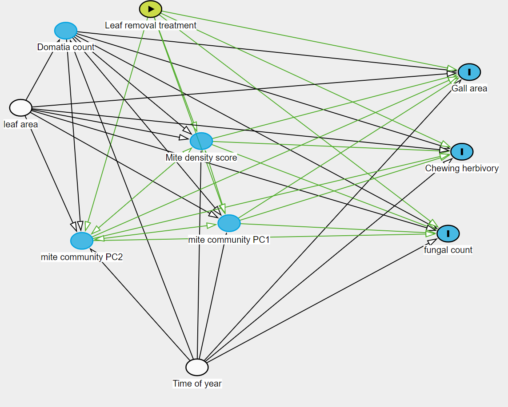

```{r, include = FALSE}
knitr::opts_chunk$set(fig.align = "center", comment = NA, eval = TRUE, warning = FALSE, message = FALSE)
modelonly <- TRUE
```


```{r, include = FALSE}
# Functions from herbivar

```


# Set up {.tabset}

## Liberies
```{r}
library(tidyverse)
library(glmmTMB)
library(performance)
library(sjPlot)
library(vegan)
library(ggpubr)
library(herbivar) # https://github.com/vsbpan/herbivar
#library(piecewiseSEM)
#library(DHARMa)
```


## Brief note on image processing 
\
This is what we have as the original scanned images (600 dpi). 
```{r, eval = modelonly}
img <- load.image("images/original_raw/marcescence_project_2022_May/tree1_20220517.jpeg") %>% 
  thin(20) # reduce image resolution to enhance plotting speed.
plot(img)
```

\
For each image, the script `leaf_image_segmentation.R` cuts out the individual leaves as such: 
```{r, eval = modelonly}
img <- load.image("images/segmented_raw/2022_May_isolate/tree1_20220517_leaf3.png") %>% 
  thin(5)
plot(img)
```

Then, we use paint to manually pick out the background, the intact leaf area, the missing leaf area, and the mite galls: 

```{r, eval = modelonly}
img <- load.image("images/segmented_processed/2022_May_isolate/tree1_20220517_leaf3.png") %>% 
  thin(5)
plot(img)
```

The script `read_painted_leaves.R` then reads the different marked regions of the processed images and outputs a .csv file. It's basically counting pixels. Of note is that there is a detection limit of galls at 0.1% of the leaf area and chewing herbivory at 0.5% of the leaf area. The pipeline relies on the packages `pliman`, `imager`, and `herbivar`. 
```{r, eval = modelonly}
citation("imager")
citation("pliman")
citation("herbivar")
```


## Cleaned data READ ME

|                                      *File: beech_marcescence_cleaned.csv*
**tree**: Unique tree identifier\
**leaf**: Unique leaf identifier\
**treatment**: Whether the tree had its leaves removed in the winter ("control" or "treatment")\
**exp.round**: Survey session (1,2,3)\
**field.date**: Date of leaf collection\
**lab.date**:  Date of mite examination (?)\
**field.obs**:  Observer initials (not analyzed)\
**lab.mite.obs**:  Observer initials (not analyzed)\
**dom**:  count of domatia on the leaf\
**eggs**:  count of mite eggs on the leaf\
**RS**:  ? mite morphospecies count \
**LB**:  ? mite morphospecies count \
**nymph**:  ? mite nymphs count (multiple morphospecies)\
**OB**:  ? mite morphospecies count \
**LL**:  ? mite morphospecies count \
**LC**:  ? mite morphospecies count \
**CLB**:  ? mite morphospecies count \
**SP**:  ? mite morphospecies count \
**MISC**:  ? mite morphospecies count (multiple morphospecies) \
**BY**:  ? mite morphospecies count \
**PR**:  ? mite morphospecies count \
**B**: ? mite morphospecies count \
**eriophyid.pres**:  visual assessment of the presence/absence of Eriophid galls (not analyzed)\
**fungal.obs**:  Observer initials (not analyzed)\
**fungal.count**:  Count of fungal bodies\
**fungal.notes**:  Notes (not analyzed)\
**midrib.tape**:  Not sure what this is (not analyzed)\
**leaf.tear**:  Not sure what this is (not analyzed)\
**mite.notes**:  Notes (not analyzed)\
**field.notes**:  Notes (not analyzed)\
**gall_mm2**:  Area of Eriophid galls in mm2 from leaf scan images\
**prop_herb**:  Proportion of leaf with chewing damage from leaf scan images\
**leaf_area_mm2**:  Area of leaf in mm2 from leaf scan images\
**longitude**:  Longitude in degree decimals of the tree\
**latitude**:  Latitude in degree decimals of the tree\
**elevation**: Elevation in meters of the tree \


## More data cleaning
```{r}

d <- read_csv("cleaned_data/beech_marcescence_cleaned.csv") # Read data

# Change to factor for AR1
d$exp.round <- factor(d$exp.round)

d$total.good.mites <- with(d, RS + LB + OB + LL + B + LC + CLB + SP + MISC + BY + PR + nymph)

d$total.good.mites.adults <- d$total.good.mites - d$nymph

# Species considered in the composition analysis
species_col <- c("RS", "LB", "OB", "LL", "B", "LC", "CLB", "SP", "MISC", "BY", "PR")
community_mat <- d[species_col]

# Simple PCA, keeping track of the tree id
# Hellinger transform the community matrix
pca.out <- rda(hellinger_trans(community_mat) ~ 
                 Condition(tree), 
               data = d)

screeplot(pca.out) # Looks like it is enough to grab the first two PCs
d <- d %>% 
  mutate(PC1 = scores(pca.out)$sites[,1], 
         PC2 = scores(pca.out)$sites[,2], 
         shannon.H = vegan::diversity(community_mat)) # Add them to the data as an index of community composition


d$dom_log <- log(d$dom)
d$leaf_area_mm2_log <- log(d$leaf_area_mm2)
d$herb_mm2 <- d$prop_herb * d$leaf_area_mm2
d$herb_mm2_log <- log(d$herb_mm2 + 1)
d$gall_mm2_log <- log(d$gall_mm2 + 1)
d$fungal.count_log <- log(d$fungal.count + 1)

# Add scaled predictors
d <- d %>% cbind(
  d %>% 
  dplyr::select(PC1, PC2, dom_log, shannon.H, 
                leaf_area_mm2_log, fungal.count, 
                gall_mm2, herb_mm2, fungal.count_log, 
                gall_mm2_log, herb_mm2_log) %>% 
  mutate_all(function(x) as.numeric(scale(x))) %>% 
  rename_all(.funs = function(x)paste0(x,".scale"))
)

```


# Exploratory Analysis {.tabset}
## Histograms 
```{r, include = FALSE}
interesting_variable_names1 <- c(species_col,"nymph","eggs","total.good.mites","total.good.mites.adults")
interesting_variable_names2 <- c("leaf_area_mm2","prop_herb","gall_mm2","fungal.count","PC1","PC2","dom","shannon.H")
explore_data_1 <- d %>% 
  gather(key = variable, value = value, all_of(interesting_variable_names1))
explore_data_2 <- d %>% 
  gather(key = variable, value = value, all_of(interesting_variable_names2))

explore_data_1tree_avg <- explore_data_1 %>% 
  mutate(month = gsub("[0-9]|-","",field.date)) %>% 
  dplyr::select(variable, tree, exp.round, value, month, treatment, longitude, latitude) %>% 
  group_by(exp.round, tree, variable) %>% 
  summarise_all(function(x){
    if(is.numeric(x)){
      mean(x)
    } else {
      unique(x)
    }
  })

explore_data_2tree_avg <- explore_data_2 %>% 
  mutate(month = gsub("[0-9]|-","",field.date)) %>% 
  dplyr::select(variable, tree, exp.round, value, month, treatment, longitude, latitude) %>% 
  group_by(exp.round, tree, variable) %>% 
  summarise_all(function(x){
    if(is.numeric(x)){
      mean(x)
    } else {
      unique(x)
    }
  })

```

```{r, eval = modelonly}
explore_data_1 %>% 
  ggplot(aes(x = value)) + 
  geom_histogram(color = "navy", fill = "steelblue") + 
  facet_wrap(~variable, scales = "free") + 
  theme_bw(base_size = 10)

explore_data_2 %>% 
  ggplot(aes(x = value)) + 
  geom_histogram(color = "navy", fill = "steelblue") + 
  facet_wrap(~variable, scales = "free") + 
  theme_bw(base_size = 15)
```

## Variables by leaf position
```{r, eval = modelonly}
explore_data_1 %>% 
  ggplot(aes(x = factor(leaf),y = value, color = factor(leaf))) + 
  geom_boxplot() +
  geom_point(position = "jitter", alpha = 0.3) + 
  facet_wrap(~variable, scales = "free") + 
  theme_bw(base_size = 10)

explore_data_2 %>% 
  ggplot(aes(x = factor(leaf),y = value, color = factor(leaf))) + 
  geom_boxplot() +
  geom_point(position = "jitter", alpha = 0.3) + 
  facet_wrap(~variable, scales = "free") + 
  theme_bw(base_size = 15)
```


## Variables by experiment round

```{r, eval = modelonly}
explore_data_1tree_avg %>% 
  ggplot(aes(x = exp.round, y = value, color = month)) + 
  geom_boxplot() + 
  geom_point(position = "jitter", alpha = 0.5) + 
  facet_wrap(~variable, scales = "free") + 
  theme_bw(base_size = 10)


explore_data_2tree_avg %>% 
  ggplot(aes(x = exp.round, y = value, color = month)) + 
  geom_boxplot() + 
  geom_point(position = "jitter", alpha = 0.5) + 
  facet_wrap(~variable, scales = "free") + 
  theme_bw(base_size = 15)
```


## Variables by treatment

```{r, eval = modelonly}
explore_data_1tree_avg %>% 
  ggplot(aes(x = treatment, y = value, color = treatment)) + 
  geom_boxplot() + 
  geom_point(position = "jitter", alpha = 0.5) + 
  facet_wrap(~variable, scales = "free") + 
  theme_bw(base_size = 10)

explore_data_2tree_avg %>% 
  ggplot(aes(x = treatment, y = value, color = treatment)) + 
  geom_boxplot() + 
  geom_point(position = "jitter", alpha = 0.5) + 
  facet_wrap(~variable, scales = "free") + 
  theme_bw(base_size = 15)
```

## Variables by space
```{r, eval = modelonly}
explore_data_1tree_avg %>% 
  mutate(valuelog = log(value + 1)) %>% 
  ungroup() %>% 
  group_split(variable) %>% 
  map(
    ~ggplot(., aes(x = longitude, y = latitude, color = valuelog)) + 
      geom_point(size = 2, show.legend = FALSE) + 
      theme_bw(base_size = 8) + 
      scale_color_viridis_c() +
      facet_grid(~variable, labeller = function(x) label_value(x, multi_line = FALSE))
  ) %>% 
  ggpubr::ggarrange(plotlist = .)


explore_data_2tree_avg %>% 
  mutate(valuelog = log(value + 1)) %>% 
  ungroup() %>% 
  group_split(variable) %>% 
  map(
    ~ggplot(., aes(x = longitude, y = latitude, color = valuelog)) + 
      geom_point(size = 2, show.legend = FALSE) + 
      theme_bw(base_size = 8) + 
      scale_color_viridis_c() +
      facet_grid(~variable, labeller = function(x) label_value(x, multi_line = FALSE))
  ) %>% 
  ggpubr::ggarrange(plotlist = .)
```


## Mite community PCA
```{r, eval = modelonly}
#First 2 PCs
pca.out %>% 
  get_biplot() 

# Visualize site scores
pca.out %>% 
  get_biplot(group = d$treatment, 
             display = c("sites"), scaling = "sites")

pca.out %>% 
  get_biplot(group = d$exp.round, 
             display = c("sites"), scaling = "sites")
```


## Missing values

First number is the number of complete records. Second number is the number of missing values. Each record is a leaf. 

```{r, eval = modelonly}
#Missing values
d %>% 
  dplyr::select(treatment, exp.round,
                all_of(interesting_variable_names1), 
                all_of(interesting_variable_names2)) %>%
  group_by(exp.round,treatment) %>%
  summarise_all(function(x){
    paste0(sum(!is.na(x)),"-",sum(is.na(x)))
  }) %>% 
  as.data.frame()
```

# Main Analyses


## A quick description of the analyses


My understanding is that we sort of have three main questions: \

(1) How does marcescence or domatia affect the mite bodyguards of beech trees? \

(2) How do mite bodyguards affect the pathogens and herbivores on beech trees? \

(3) Does marcescence or domatia affect the herbivory or pathogen risk of beech trees, possibly via mite bodyguards? \

\
Because we are interested in a community of mite bodyguards, answering question (1) in its vague sense sort of include looking at three ecologically important features of any assemblage of species: the density, diversity, and community composition. The prior two features involve simple GLMMs, whereas the latter involves performing constrained ordination. \

\
After analyzing the mite community, we move on to looking at important biological outcomes (gall area, chewing herbivory, fungal count) that may have responded to treatment or domatia count. In general, for each model, we include treatment and log(domatia count) along with other bare minimum model structures. We have both treatment and log(domatia count) in the same model mostly to reduce the number of models that we have to keep track of. log(domatia count) and treatment seem to not be that correlated so having both in the same model doesn't affect the model coefficients that much. \

The bare minimum model structures include the following: \

(1) random intercept of tree ID to keep track of each tree (each row is a leaf) \

(2) a fixed effect of experimental round (factor) to account for time dependent trends \

(3) a first order autoregressive component AR(1) that accounts for time dependence in the error structure. \

(4) I also included log(leaf_area_mm2) to account for the confounding relationships. For instance, when modeling fungal counts as a function of mite counts, we might expect this to hold: $$\text{mite count} \leftarrow \text{leaf area} \rightarrow \text{fungal count}$$ or similarly 
$$\text{mite count} \leftarrow \text{leaf area} \rightarrow \text{gall area}$$

\

I did not include leaf position or space into the models because preliminary data explorations indicate that they are probably not important. In cases where there is quite a bit of spatial structure in the variable (e.g. mite counts), the results don't change qualitatively (or the spatial version of the method, if it exits, is so very very annoying) so again, we'll just ignore space. I also tested some interactions here and there and they don't seem to be supported, so I have mostly showed you results of models without any interaction. Finally, because our missing leaf scans are probably missing completely at random, the missingness would not bias the estimates, so I don't attempt to do any imputation. 

\
After that we put everything together into a structural equation model where we test the specific structural hypotheses we have from question (2 and 3). It is important that we start with a reasonable meta-model structure and look at the size of the coefficients rather than performing model selection via AIC as has been advocated by some in the past. AIC is irrelevant to causal inference (Arif and MacNei 2022). I drew a DAG below that I think captures what is going out outside. Notice that we have to adjust for exp.round (time of year) and leaf area to get unbiased estimate of the effect of domatia count. The double arrows in there indicate correlated errors. 
\
```{r}

```


\
\
Note that all continuous variables are Z-score transformed prior to fitting, so the regression coefficients are standardized. 

\

## Mite density {.tabset}

**key takeaways**: Only domatia density and time of year affected mite density. I tried fitting random slope models and zero-inflated models and the result is qualitatively the same. 

### Model 

```{r}
# gather species
d.gathered <- d %>% 
    gather(key = morphospecies, value = mite_count,all_of(species_col))

# Note that unlike other models, each row here is a unique morphospecies on a unique leaf during a unique time of year. We have morphospecies as a random intercept to keep track of each species. 
den.m1 <- readRDS("RDS_files/den.m1.rds") # Takes too long to fit. Model code below
# den.m1 <- glmmTMB(
#   mite_count ~ 
#     treatment +
#     dom_log.scale + 
#     leaf_area_mm2_log.scale + 
#     exp.round +
#     (1 | morphospecies) + 
#     (1 | tree)  + 
#     ar1(0 + exp.round | tree), 
#   family = nbinom2(link = "log"),
#   data = d.gathered
#   ); summary(den.m1)
summary(den.m1)

```


### Diagnostics
```{r, eval = modelonly}
# This is okay. dom_log in mixture models is significant for the bernoulli part of the model where the outliers don't matter. 
DHARMa::simulateResiduals(den.m1) %>% plot()
performance::check_collinearity(den.m1)
```

### Plot

```{r, eval = modelonly}
#Tentative plot. 
den.m1.re <- ggeffects::ggpredict(den.m1, terms = c("dom_log.scale","exp.round","morphospecies"), type = "random")


den.m1.re %>% 
  as.data.frame() %>% 
  ggplot(aes(x = exp(x * sd(d$dom_log) + mean(d$dom_log)), # Undo Z score transform then undo log
             y = predicted)) + 
  geom_ribbon(aes(ymax = conf.high, ymin = conf.low, fill = factor(group)), alpha = 0.3) + 
  geom_line(aes(color = factor(group)), size = 1.5) + 
  facet_wrap(~facet, scales = "free") + 
  geom_point(data = den.m1$frame %>% 
               mutate(facet = morphospecies), 
             aes(x = exp(dom_log.scale * sd(d$dom_log) + mean(d$dom_log)), 
                 y = mite_count, color = exp.round), alpha = 0.3) +
  theme_bw(base_size = 15) + 
  scale_fill_brewer(aesthetics = c("fill","color"), type = "qual") + 
  labs(x = "Domatia count", y = "Mite count", color = "Round",fill="Round")
```


### Misc stats

**random effect variance may be unreliable**

```{r, eval = modelonly}
r2(den.m1, tolerance = 10^-8)
```


## Mite diversity {.tabset}

**key takeaways**: Only domatia density and time of year affected mite diversity. 

### Model 

```{r}
div.m1 <- glmmTMB(
  shannon.H ~ 
    treatment +
    dom_log.scale + 
    leaf_area_mm2_log.scale + 
    exp.round +
    (1 | tree)  + 
    ar1(0 + exp.round | tree), 
  family = tweedie(link = "log"),
  data = d
); summary(div.m1)
```


### Diagnostics

```{r, eval = modelonly}
DHARMa::simulateResiduals(div.m1) %>% plot()
```


```{r, eval = modelonly}
performance::check_collinearity(div.m1)
```


### Plot
```{r, eval = modelonly}
plot_model(div.m1, type = "pred", terms = c("dom_log.scale","exp.round"), show.data = TRUE) + 
  theme_bw(base_size = 15) + 
  labs(title = "")
```


### Misc stats
**random effect variance may be unreliable**

```{r, eval = modelonly}
r2(div.m1,tolerance = 10^-10)
```


## Mite community composition {.tabset}

**key takeaways**: Only time of year strongly affected community composition. 

### Model 
```{r}
d2 <- d %>%  # First get rid of NAs
  filter(!is.na(leaf_area_mm2))

cmp.m1 <- rda(hellinger_trans(d2[,species_col]) ~ 
      treatment + 
      dom_log.scale + 
      leaf_area_mm2_log.scale + 
      exp.round + 
      Condition(tree), 
    data = d2)
cmp.m1
```

```{r, eval = modelonly}
anova(cmp.m1, by = "mar", model = "reduced")
anova(cmp.m1, by = "axis")
```

### Plot 

```{r, eval = modelonly}
get_biplot(cmp.m1)
```


## Gall area {.tabset}

**key takeaways**: Only time of year affected gall area, with most galls occurring during July 

### Model 

```{r}
# Same result as with a zero-inflated Gamma model
ga.m1 <- glmmTMB(
  gall_mm2 ~ 
    treatment +
    dom_log.scale +
    leaf_area_mm2_log.scale + 
    exp.round + 
    (1|tree)  + 
    ar1(0 + exp.round | tree), 
  family = tweedie(link = "log"),
  data = d %>% 
    mutate(dom_log.scale = scale(dom_log)),
  control=glmmTMBControl(optimizer=optim,
                         optArgs=list(method="BFGS"))
); summary(ga.m1)
```


### Diagnostics

```{r, eval = modelonly}
DHARMa::simulateResiduals(ga.m1) %>% plot()
check_collinearity(ga.m1)
```


### Plot
```{r, eval = modelonly}
plot_model(ga.m1, type = "pred", terms = c("exp.round"), show.data = TRUE, jitter = TRUE) + 
  labs(title = "") + 
  theme_bw(base_size = 15)
```


### Misc stats
**random effect variance may be unreliable**
```{r, eval = modelonly}
r2(ga.m1)
```


## Chewing herbivory {.tabset}

**key takeaways**: Treatment and domatia density increased herbivory, which is most severe in May. Larger leaves had lower herbivory, probably because they were able to toughen before peak herbivory occurred. The treatment result is in contrast with the chewing herbivory result of Karban (2008). 

### Model 
```{r}
# Same result as with a zero-inflated Gamma model
herb.m1 <- glmmTMB(
  herb_mm2 ~ 
    treatment +
    dom_log.scale +
    leaf_area_mm2_log.scale + 
    exp.round + 
    (1|tree)  + 
    ar1(0 + exp.round | tree), 
  family = tweedie(link = "log"),
  data = d
); summary(herb.m1)
```


### Diagnostics
```{r, eval = modelonly}
# Not too shabby
DHARMa::simulateResiduals(herb.m1) %>% plot()
check_collinearity(herb.m1)
```

### Plot
```{r, eval = modelonly}
ga.m1.pred <- ggeffects::ggpredict(ga.m1, terms = c("dom_log.scale","treatment", "exp.round"))
g1 <- ga.m1.pred %>% 
  as.data.frame() %>% 
  ggplot(aes(x = exp(x * sd(d$dom_log) + mean(d$dom_log)), 
             y = predicted)) + 
  geom_ribbon(aes(ymax = conf.high, ymin = conf.low, fill = group), alpha = 0.2) +
  geom_line(aes(color = group), size = 2) + 
  facet_wrap(~facet, scales = "free") + 
  theme_bw(base_size = 15) + 
  labs(x = "domatia count", y = expression(Herbivory~mm^2), 
       color = "Leaf removal", fill = "Leaf removal") + 
  scale_color_brewer(type = "qual", aesthetics = c("fill","color")) 
g1 


# Looks really weird with the raw data points bc of tweedie distribution. We actually don't detect any outliers and the when we look at a zero-inflated Gamma GLMM, we find that the part that is driving the pattern is the presence/absence part, so the very high outliers don't matter. 
g1 + geom_point(data = d %>% 
               mutate(facet = exp.round), 
             aes(x = dom, y = herb_mm2, color = treatment))
```


### Misc stats

**random effect variance may be unreliable**
```{r, eval = modelonly}
# random effect variance may be unreliable bc of convergence issue
r2(herb.m1, tolerance = 10^-10)
```


## Fungal count {.tabset}
**key takeaways**: Only time of year affected fungal count.  

### Model 
```{r}
fg.m1 <- glmmTMB(
   fungal.count~ 
    treatment +
    dom_log.scale +
    leaf_area_mm2_log.scale + 
    exp.round + 
    (1|tree)  + 
    ar1(0 + exp.round | tree), 
  family = nbinom2(link = "log"),
  data = d
); summary(fg.m1)
```


### Diagnostics

**So the diagnostics don't look that great. The quasi-Poisson distribution seems to be a better choice as the conditional distribution (yielding no issue in the diagnostics), but since the results don't change qualitatively, we will only consider the type II negative binomial model for the sake of simplicity.**

```{r, eval = modelonly}
DHARMa::simulateResiduals(fg.m1) %>% plot()
check_collinearity(fg.m1)
```

### Plot
```{r, eval = modelonly}
plot_model(fg.m1, type = "pred", terms = c("exp.round"), show.data = TRUE, jitter = TRUE) + 
  labs(title = "") + 
  theme_bw(base_size = 15)
```


### Misc stats
**random effect variance estimate many be unreliable**
```{r}
r2(fg.m1, tolerance = 10^-10)
```


# Structural Equation Model {.tabset}

**key takeaways**: Treatment increased chewing herbivory not through any variables measured in the study. Domatia density increased mite density, which reduced fungal count. Mite community composition also affected fungal count, but nothing predicted mite community composition. Nothing explained gall area. 

## Extract mite density score

Here, I use the previous mite density GLMM we fitted to generate a predicted mite density propensity score. We are interested in some idea of mite 'density' affecting our response variable of interest, but we have many morphospecies of mites and it is preferable to not treat them identically. We also don't want to include each morphospecies in the model as a predictor-- that is too many variables. A solution is to generate a latent variable that takes into account that some morphospecies may be more abundant than others. We do this by taking the predicted average global mite density from the GLMM we fitted. It is not species specific because we don't allow the prediction to include species random effects. 

```{r}
d <- d.gathered %>% 
  cbind("pred_density_score" = predict(den.m1, # Mite density model
                                       newdata = d.gathered %>% 
                                         dplyr::select(all_of(names(insight::get_predictors(den.m1))), 
                                                       leaf, 
                                                       tree) %>% 
                                         mutate(morphospecies = "hmmmm"), # Not a real species
                                       allow.new.levels = TRUE, 
                                       type = "link")) %>% # Prediction on link scale is better behaved
  group_by(exp.round, tree, leaf) %>% 
  summarise(pred_density_score = mean(pred_density_score)) %>% # Collapse score to each leaf
  ungroup() %>% 
  right_join(d, by = c("exp.round", "leaf","tree")) %>%  # Bind to data frame for analysis
  mutate(pred_density_score = as.numeric(scale(pred_density_score)))  # Z score transform
```


## List of models
```{r}
m1 <- glmmTMB(pred_density_score ~ 
                leaf_area_mm2_log.scale + 
                treatment + 
                dom_log.scale + 
                exp.round + 
                (1| tree), 
              family = gaussian, 
              control=glmmTMBControl(optimizer=optim,
                                     optArgs=list(method="BFGS")),
              data = d); summary(m1)

m2 <- glmmTMB(PC1.scale ~ 
                leaf_area_mm2_log.scale + 
                treatment + 
                dom_log.scale + 
                exp.round + 
                (1| tree) + 
                ar1(0 + exp.round | tree), 
              family = gaussian, 
              data = d); summary(m2)


m3 <- glmmTMB(PC2.scale ~ 
                leaf_area_mm2_log.scale + 
                treatment + 
                dom_log.scale + 
                exp.round + 
                (1| tree) + 
                ar1(0 + exp.round | tree), 
              family = gaussian(), 
              data = d
              ); summary(m3)

m4 <- glmmTMB(dom_log.scale ~ 
                leaf_area_mm2_log.scale + 
                exp.round + 
                (1| tree) + 
                ar1(0 + exp.round | tree), 
              family = gaussian(), 
              data = d
              ); summary(m4)

m5 <- glmmTMB(gall_mm2 ~ 
                PC1.scale + 
                PC2.scale + 
                pred_density_score + 
                leaf_area_mm2_log.scale + 
                treatment + 
                dom_log.scale + 
                exp.round + 
                (1| tree) + 
                ar1(0 + exp.round | tree), 
              family = tweedie(), 
              control=glmmTMBControl(optimizer=optim,
                                     optArgs=list(method="BFGS")),
              data = d); summary(m5)

m6 <- glmmTMB(herb_mm2 ~ 
                PC1.scale + 
                PC2.scale + 
                pred_density_score + 
                leaf_area_mm2_log.scale + 
                treatment + 
                dom_log.scale + 
                exp.round + 
                (1| tree) + 
                ar1(0 + exp.round | tree), 
              family = tweedie(), 
              data = d); summary(m6)

m7 <- glmmTMB(fungal.count ~ 
                PC1.scale + 
                PC2.scale + 
                pred_density_score + 
                leaf_area_mm2_log.scale + 
                treatment + 
                dom_log.scale + 
                exp.round + 
                (1| tree) + 
                ar1(0 + exp.round | tree), 
              family = nbinom2(), 
              data = d); summary(m7)
```


## d-separation test
```{r}
# Using old version of piecewiseSEM that supports glmmTMB
#devtools::install_version("piecewiseSEM", version = "1.2.1", repos = "http://cran.us.r-project.org")
mod.list <- list(m1, m2, m3, m4, m5, m6, m7)
psem.out <- piecewiseSEM::sem.fit(mod.list, 
                                  corr.errors = list("PC2.scale ~~ PC1.scale", 
                                                     "PC1.scale ~~ pred_density_score", 
                                                     "PC2.scale ~~ pred_density_score"), 
                                  data = d, 
                                  .progressBar = FALSE)
psem.out # Looks like there are no missing paths
```


## SEM coefficeints

**The coefficients still need to be standardized in some cases**
```{r}
piecewiseSEM::sem.coefs(modelList = mod.list, 
          data = d)
```

## SEM plot

```{r}
piecewiseSEM::sem.plot(mod.list, data = d, show.nonsig = FALSE)
```


# References
Arif, S., and A. MacNeil. 2022. Predictive models aren’t for causal inference. Ecology Letters n/a.  
/
Karban, R. 2008. Leaf Drop in Evergreen Ceanothus velutinus as a Means of Reducing Herbivory. Ecology 89:2446–2452.


# Session Info 
```{r}
sessionInfo()
```

